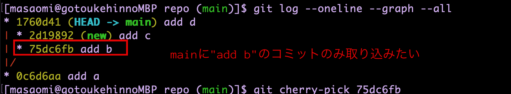
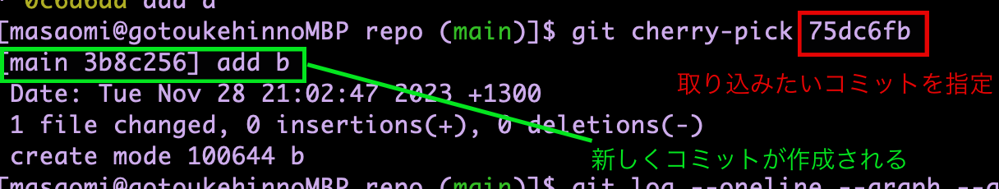
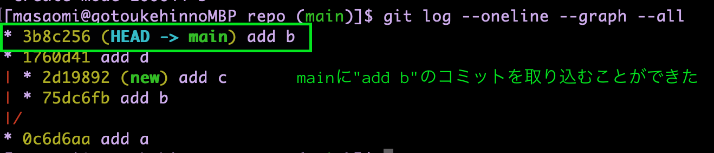

### cherry pickとは
- 他のブランチの特定のコミットだけを取り込みたい

    - mergeは指定したブランチの全てのコミットを取り込む
    - cherry pickは指定したコミットのみ取り込む

---

### cherry pickする

- ブランチBのコミットをブランチAに取り込みたいと仮定する

```bash
# ブランチAにチェックアウト
git checkout <ブランチA>　

# ブランチBの特定のコミットのみ取り込む
git cherry-pick <対象のコミットID>
```
*対象のコミットは複数指定できる

---

取り込みたいコミットを確認


<br>

取込みたいコミットを指定


<br>

取り込めているか確認


---

### 変更は取り込みたいけどコミットはしたくない場合

```bash
git cherry-pick -n <対象コミット>
```

結果、変更はワーキングディレクトリに反映されるが、コミットは作成されていない