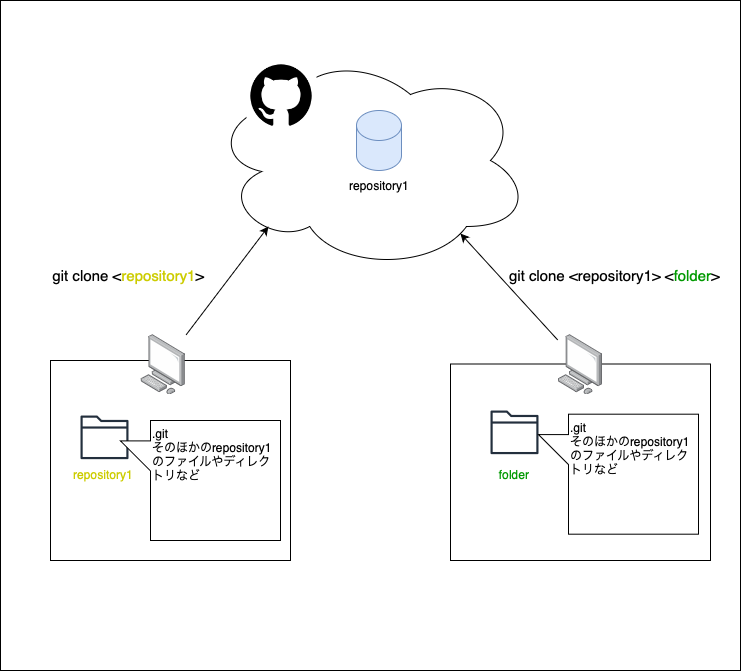

### clone （デフォルト）

```bash
git clone <repo_url>
```

上記を実行すると、リポジトリ名のディレクトリが新たに作成される

<br>

#### ディレクトリ名を指定してcloneする場合

```bash
git clone <repo_url> <path>
```

イメージ


<br>
<br>

参考サイト

[Gitリポジトリを特定のフォルダーに複製する](https://www.techiedelight.com/ja/clone-a-git-repository-into-specific-folder/)