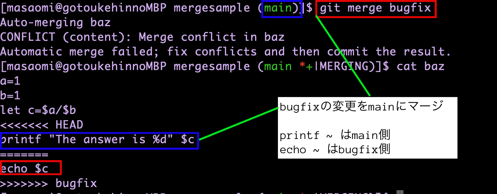
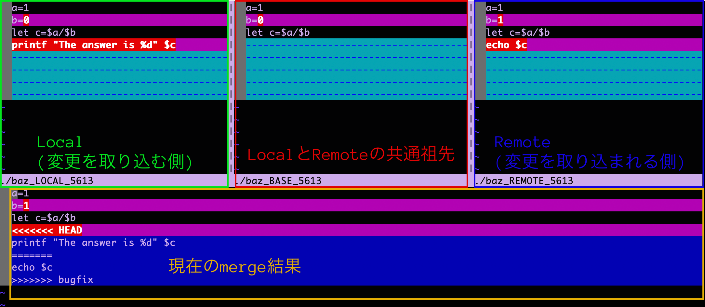
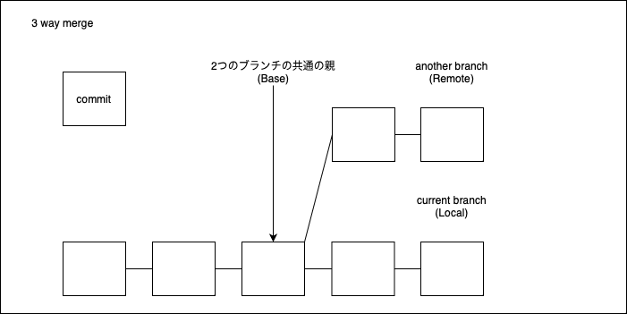

### コンフリクトが起きたファイルの中身

ブランチBの変更をブランチAに取り込む際にコンフリクトが起きた

```
<<< ブランチA
ブランチA側の変更
===
ブランチB側の変更
>>>ブランチB
```



<br>

**コンフリクトの解決手順**

1. 反映する方の変更を残し、残りは削除する (<<< === >>> のマーカーも削除する)

2. git add で解決したファイルをステージングする

3. git commit でコミットする

---

### mergetoolの利用

コンフリクトの解決ツール

```bash
git mergetool
```



<br>

上記ツールは3者間マージを利用している

<br>

- ペイン間の移動
    
    Local/Base/Remore/現在のmergeのペイン感の移動はキーで行う

    1. ctr + w (*押した後は指を離す)
    2. 上下左右キー

    もしくは  

    1. ctr + w (*押した後は指を離す)
    2. h(←), j(↓), k(↑), l(→)

- コンフリクトの解決手順

    1. 現在のmergeペインに移動

    2. 競合部分にカーソルを当てる

    3. <font color=red>\<n\>do とキーを押すと n(数字)に応じて変更が現在のmergeに適応される  
    *1:Localを適応 / 2: Baseを適応 / 3: Remoteを適応</font>

    4. エディターを終了する　 (変更を反映したファイルは:wq / そうでないファイルは:q)

    5. git status で状態を確認  
    **<対象ファイル名>.orgというファイルが作られているが必要なければ削除**

    6. マージしたファイルを add & commit

---

### 3者間マージとは (3 way merge)



Base, Remote, Localの3バージョンを比較してマージする方法

---

### コンフリクトが起きたのでマージをやめたい場合

```bash
git merge --abort
```