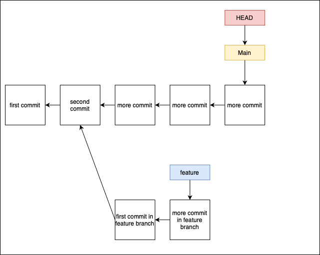
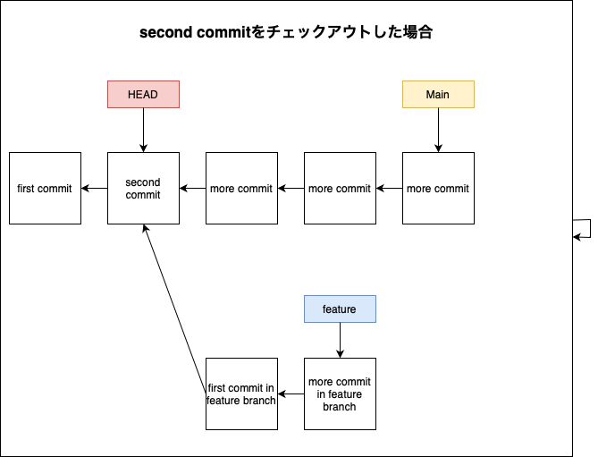

### git checkoutとは

1. ブランチを切り替える

2. 過去のコミットを取り出す

---

### ブランチを切り替える

```bash
git checkout <対象ブランチ名>
```

---

### 過去のコミットを取り出す

- git checkout <コミットID or タグ名>

```bash
# tag: var1のコミットを取り出す
git checkout ver1

# コミットID:65d0287 を取り出す
git checkout 65d0287
```

---

### 今いるブランチの最新コミットに戻る

- ブランチ名は常に、そのブランチの最新コミットを指している






```bash
# 例

# mainブランチのどこかの過去のコミットを取り出す
git checkout 65d0287

# mainブランチの最新コミットに戻る
git checkout main
```

---
<a id="branch"></a>

### ブランチの作成とそのブランチへのチェックアウトを同時に行う

```bash
git checkout -b <ブランチ名> (コミットID)
```
*コミットIDを省略すると、現在の最新のコミットからブランチを作成する

---

### 指定したブランチから新しいブランチを切る

```bash
git checkout -b <新しいブランチ> <指定ブランチ>
```