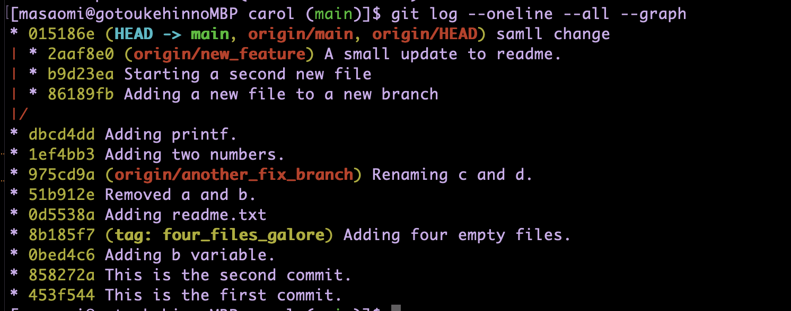
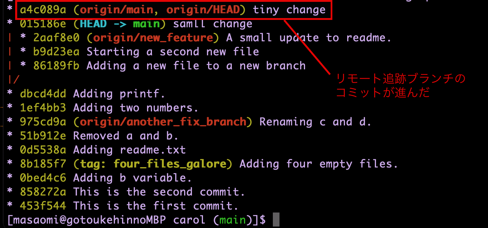

### fetchとは

- リモートリポジトリの変更をローカルのリモート追跡リポジトリに持ってくるコマンド


例


<br>

他の人がリモートのmainブランチにコミットをpushしたのでfetchしてみると

<br>



---

### fetchする

```bash
git fetch
```

実は上記コマンドは下記のショートハンドラ

```bash
git fetch <リモートリポジトリのラベル名>　<リモートリポジトリのブランチ名>:<ローカルリポジトリのリモート追跡ブランチ名>
```

例: originが設定されているローカルリポジトリがmainをfetchしたいケース
```bash
git fetch origin main:remote/origin/main
# remotesはなくてもいい
git fetch origin main:origin/main
```

---

### git fetchだけだと何をfetchするのか

- リモートリポジトリの全てのブランチの変更を、ローカルのリモート追跡ブランチに反映する

---

### fetchした変更をローカルブランチにマージする

2つの方法がある  
1. git pullを行う
2. git mergeを行う

git mergeの時

```bash
# 変更をマージしたいブランチにチェックアウトしていること
git merge FETCH_HEAD

# もしくは
git merge <リモート追跡ブランチ名>
```
*リモート追跡ブランチ名は <リモートrepo>/<ブランチ名>


