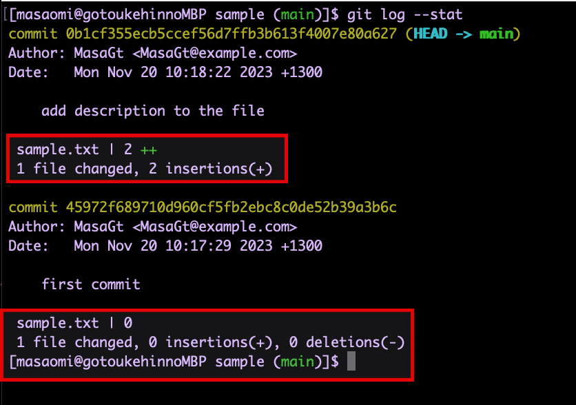
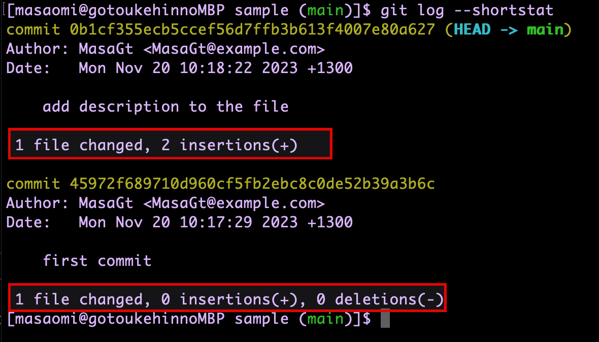
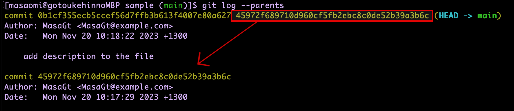
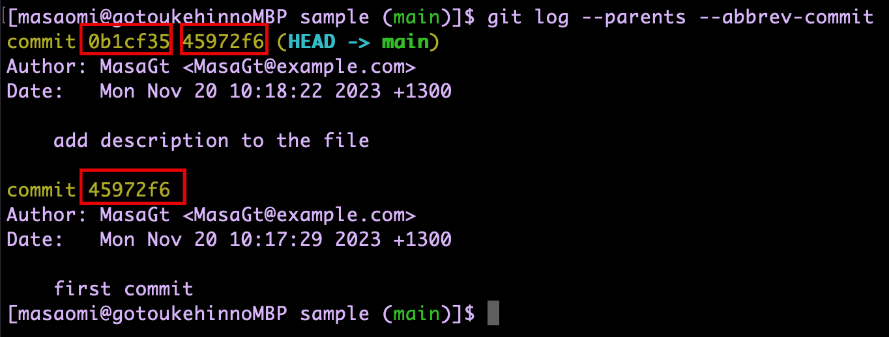
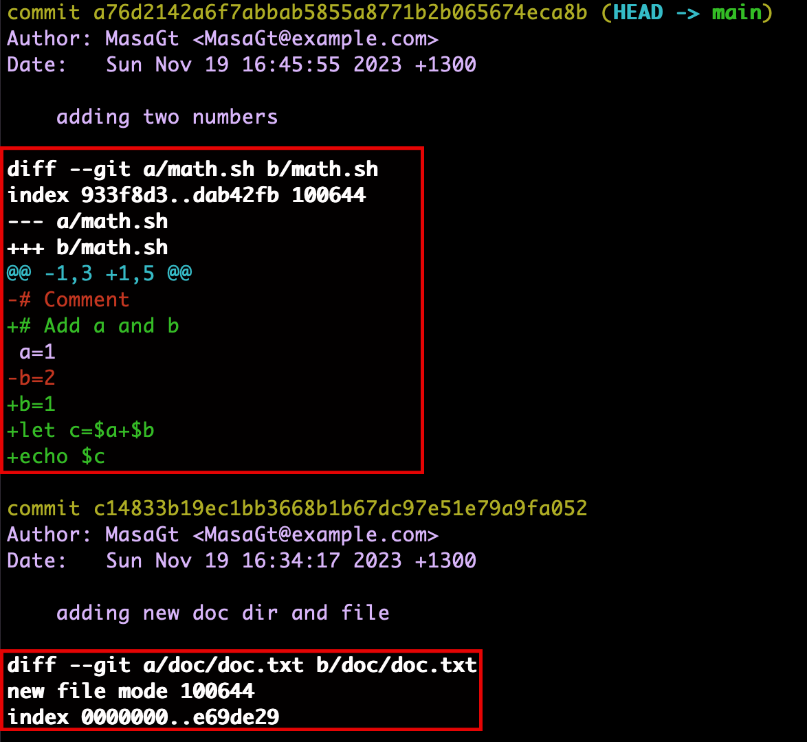
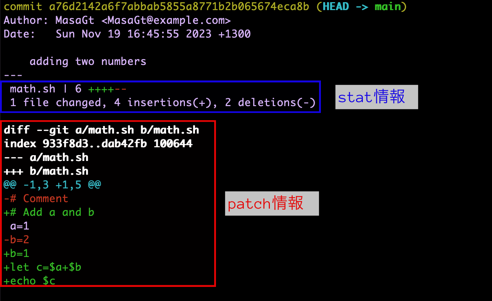
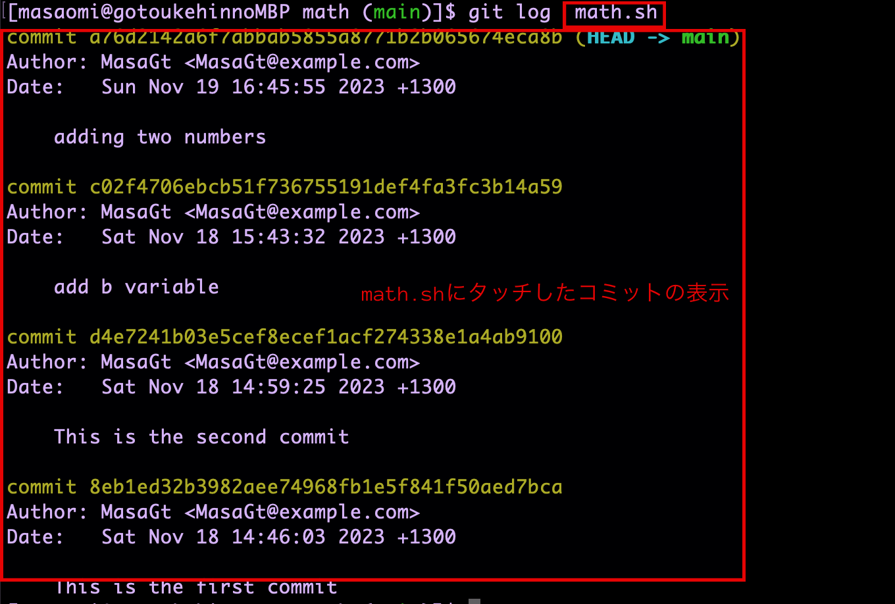
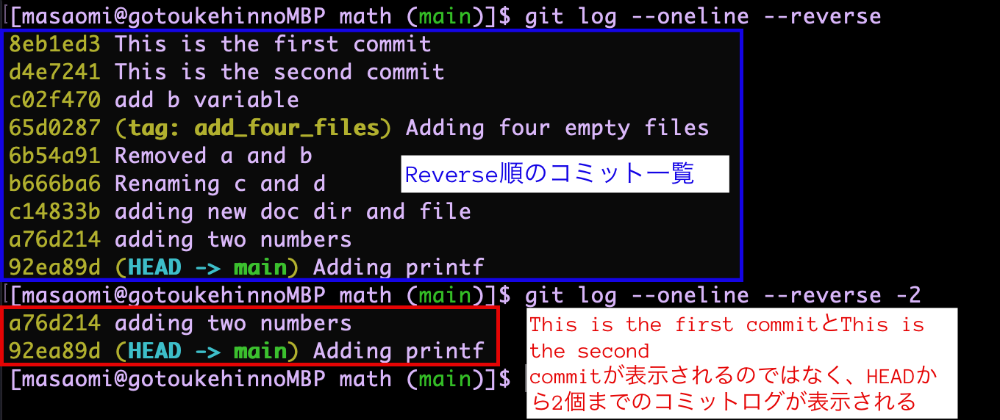
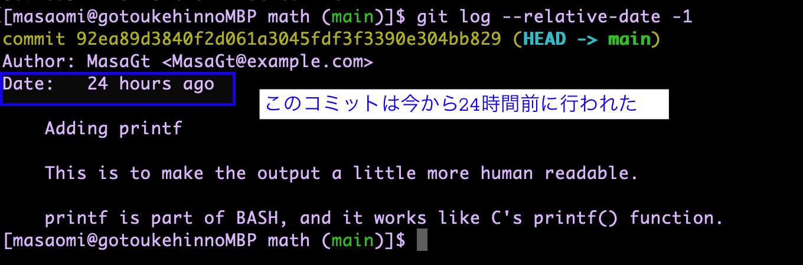

### git logの便利な引数

---

### コミットに含まれているファイルを表示する

- --stat: 各コミットログを構成しているファイルを表示する

```bash
git log --stat
```



---

### ファイルの変更の情報を表示する

- --stat: コミットログに、変更されたファイルの情報を表示する


```bash
git log --stat --oneline
```

---

- --shortstat: --stat コマンドのうち、変更/追加/削除 の行だけを表示する

```bash
git log --shortstat
```



---

### 親コミットを表示する

- --parents: そのコミットの親コミットを表示する

```bash
git log --parents
```



---

### コミットIDを省略したものにする

- --abbrev(-commit): コミットIDのフルIDではなく、短いverを表示する

```bash
git log --abbrev-commit
# もしくは git log --abbrev
```



---

### そのコミットでの変更差分を表示する

- -p or --patch: パッチ情報を表示する

```bash
git log -p
# もしくは git log --patch
```



*普通はコミットIDを指定して、特定のコミットのパッチを見る方が使いやすい

---

### patchとstat情報を一緒に表示する

- --patch-with-stat: git --patch --statと同じ

```bash
git log --patch-with-stat
# git log --patch --stat と同じ
```



---

### とあるファイル/ディレクトリの変更したコミットのみ見たい

- git log <引数> <対象ファイル/ディレクトリ>

*<引数>と<対象ファイル/ディレクトリ>の順番は入れ替えてはだめ

```bash
# math.shというファイルについてのコミットのみ表示したい
git log math.sh
```



---

### 今いるブランチの全てのコミットが見たい

 - --all: 全てのコミットログを表示する

```bash
git log --all
```

*過去のコミットをチェックアウトし、git logを使うと、チェックアウトしたコミットまでのログしか表示されない

---

### コミット履歴の表示順を逆にしたい

通常コミットログは、新しい順に表示される

- --reverse: コミットログを古い順に表示する

```bash
git log --reverse
```

---

### n個のコミットログを表示する

- -n: HEADからn個までのコミットログを表示する

*nは任意の整数

```bash
# HEADから3個までのコミットログを表示したい
git log -3

# 最新のコミットログだけ見たい
git log -1
```

<br>

*--reverse オプションと併用しても、HEADからn個までのログが表示される




---

### コミットログに表示されるコミット日時を現在時間からの相対時間で表示する

```bash
git log --relative-date
```



*--onelineはコミットした人、コミット日時を省略するので、一緒に使わないこと
