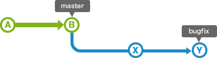

# 目次

1. [マージ](#sec1)
2. [fast forward merge](#sec2)
3. [fast forward mergeでコミットを作る](#sec3)
4. [2つのブランチのBaseコミットを探す](#sec4)
5. [2つ以上のブランチをマージする](#sec5)

---
<a id="sec1"></a>

### 他のブランチの変更を取り込む

ブランチBを変更をブランチAに取り込みたい場合

```bash
# ブランチAにcheckoutしていること
git merge <ブランチB>
```

---
<a id="sec2"></a>

### fast forward merge

- ブランチBの変更をブランチAに取り込む際に、  
ブランチBの過去コミットにブランチAの最新コミットがある場合、自動的にfast forward mergeになる  


例: bugfixをmasterにマージしたい  
bugfixの過去コミットにmasterがある


<br>

masterをbugfixに追い付かせるイメージ  
*1本に見えるが,この後bugfix,masterにそれぞれコミットすると分岐していく


<font color=red>この時、新しいコミットを作らない</font>

---
<a id="sec3"></a>

### fast forward mergeでもマージコミットを作る方法

```bash
git merge --no-ff <ブランチ名>
```

---
<a id="sec4"></a>

### ブランチAとブランチBの祖先(Base)コミットのIDを表示する

```bash
git merge-base <ブランチA> <ブランチB>
```

---
<a id="sec5"></a>

### 2つ以上のブランチの変更をマージする

ブランチB,ブランチCの変更をブランチAに取り込む
```bash
git checkuot <ブランチA>

git merge <ブランチB> <ブランチC>
```