# 目次

1. [pullとは](#sec1)
2. [pullする](#sec2)
3. [pullをfast forwardに限定する](#sec3)
4. [pullでコンフリクトが起きたら](#sec4)
5. [git pull --rebase](#sec5)
6. [リモートのリベースされたブランチを普通にgit pullしたらどうなるか](#sec6)

---

<a id="sec1"></a>

### pullとは

- ほかのリポジトリの変更を取り込むコマンド

- git pull = (git fetch) + (git merge)

---
<a id="sec2"></a>

### pullする

```bash
git pull
```

実は上記コマンドは下記のショートハンドラ

```bash
git pull <リモートリポジトリのラベル名> <プルするリモートのブランチ名>
```

---
<a id="sec3"></a>

### pullをfast forwardに限定する

- fast forward マージが可能なpullしか実行しない

```bash
git pull --ff-only
```
*もし、コンフリクトが起きるpullのときはfetchも実行されない

<br>

git configにも設定できる

```bash
git config pul.ff only
```

---
<a id="sec4"></a>

### pullでコンフリクトが起きたら

方法1

1. コンフリクトを解決し、ローカルリポジトリにコミット
2. コンフリクトを解決したコミットをリモートリポジトリにpush

方法2
1. git merge --abortで

---
<a id="sec5"></a>

### git pull --rebase

- 普通のgit pull は git fetch + git merge

- git pull --rebase = (git fetch) + (git rebase)

<br>

例: 他の人がfeatureブランチをmainの最新コミットにrebaseした。この変更を取り込みたい

*git pull --rebase は以下の操作を1コマンドで行ってくれる
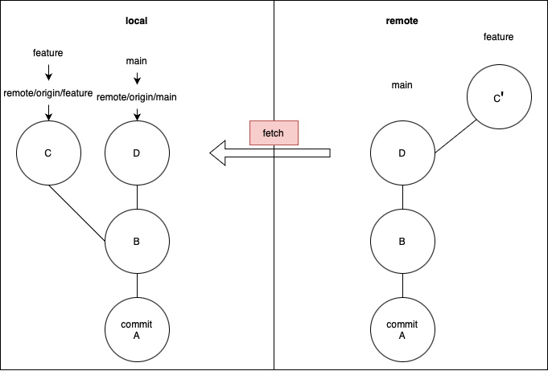

<br>

まずは、リモートの変更をfetchする  
すると、remote/origin/featureがrebaseされる
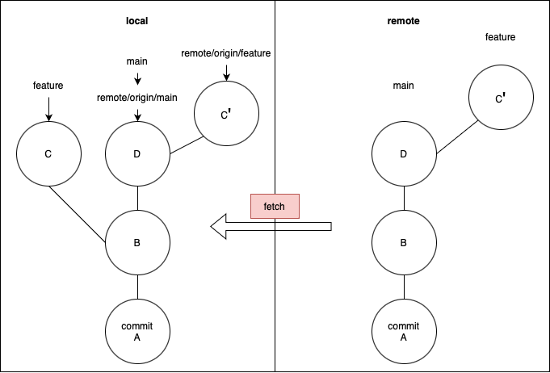

<br>

ローカルのfeatureをrebaseする
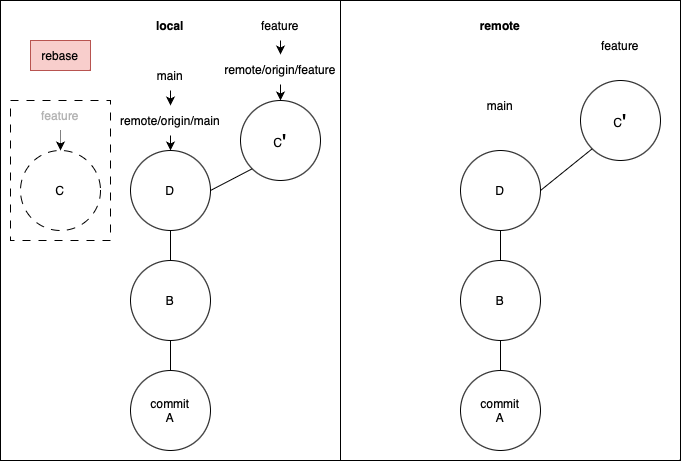

<br>

リモートの変更を反映できた

<br>

例: CLIでは上記操作はどのようになるのか

ローカルがこんな感じ
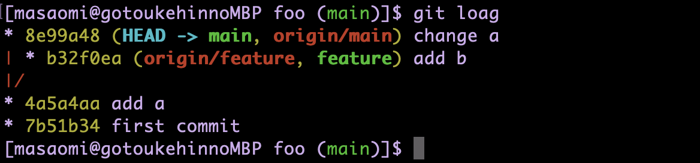

<br>

他の人が featureブランチをmainの最新コミット(change a)にrebaseした
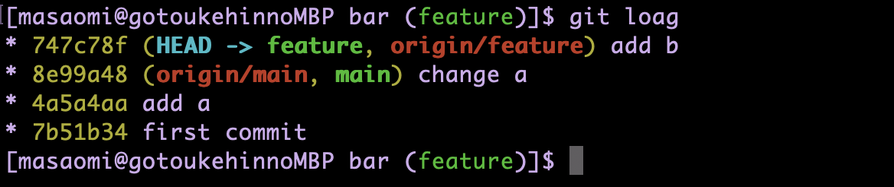

<br>

この変更を取り込むためには、まずは git fetch
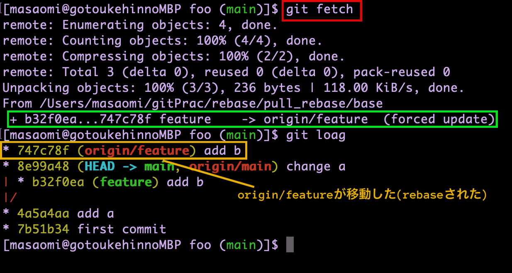

<br>

そしてfeatureをorigin/featureにリベース  
```bash
# どっちでも良い
# git rebaseだけだと、そのブランチに対応したリモート追跡ブランチにリベースする
git rebase origin/feature
git rebase
```
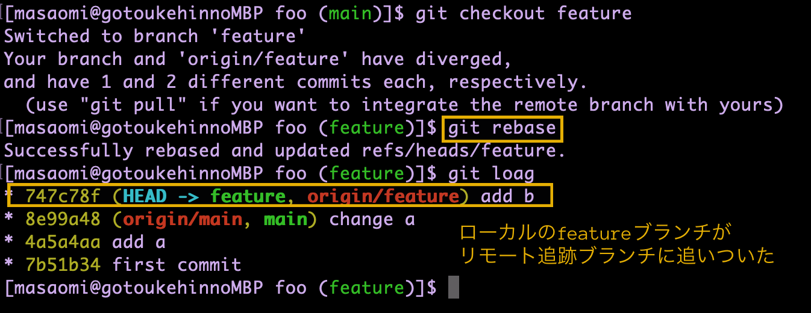

<br>

git rebase --pullは上記作業を1コマンドで済ませてくれる

---
<a id="sec6"></a>

### リモートのリベースされたブランチを普通にgit pullしたらどうなるか

- マージコミットが作られる

<br>

なぜマージコミットが作られるのか  
    - git pull = git fetch + git merge

まずはリモートの変更をfetchする


<br>

すると、remote/origin/featureがrebaseされる


<br>

ここで、featureにorigin/featureをmergeしようとするからマージコミットが作られる
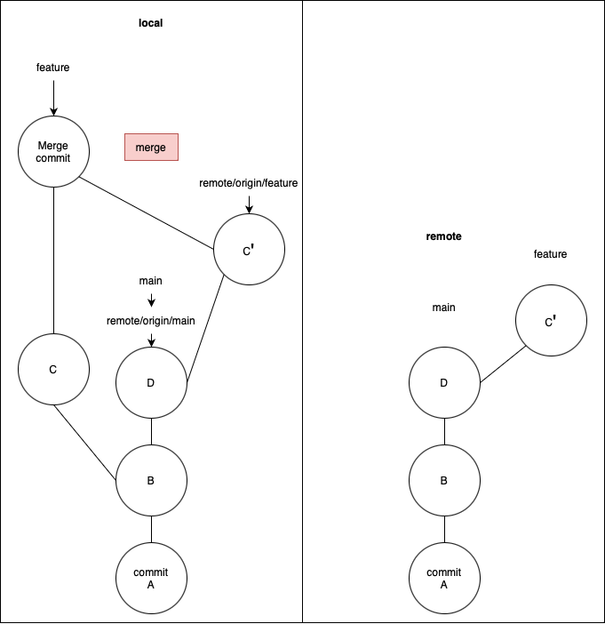

<br>

featureとremote/origin/featureを同期するにはpushする(reset して git pull --rebaseすると直る)
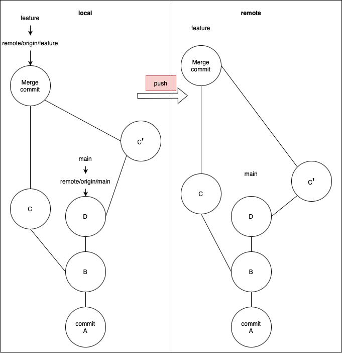


**<font color=red>結果:　気持ち悪いコミット履歴になるのでやめよう</font>**

<br>

例: CLIでは上記操作はどのようになるのか

ローカルがこんな感じ
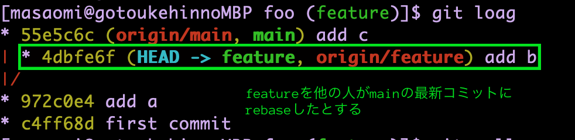

<br>

リモートの変更を取り込むためにfetch
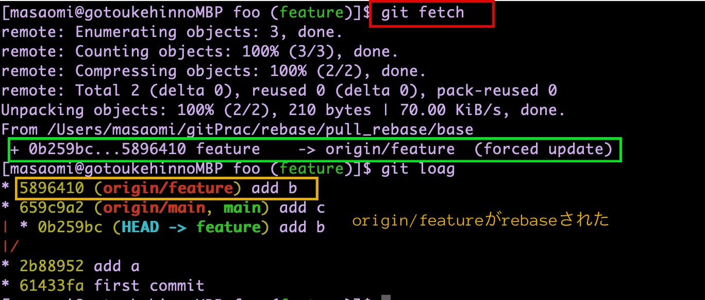

<br>

git pull = git fetch + git merge　なので  
featureにorigin/featureをmergeする
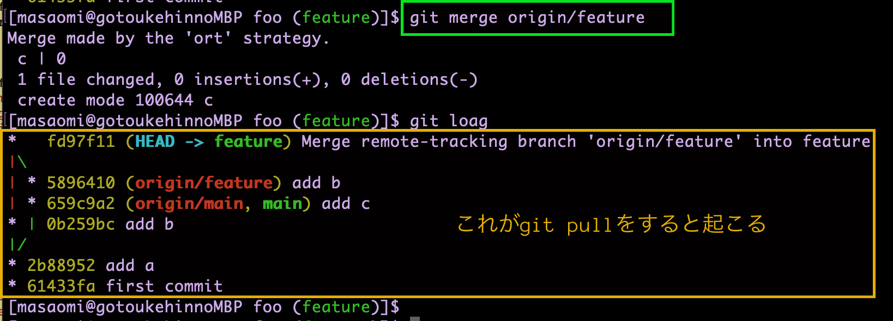

**解決策**  
上記のような気持ち悪いコミットになったらマージする前までgit reset --hardして、git rebaseするとOK

<br>

rebase変更をgit pullで取り込もうとしたら、マージコミットが作られちゃった
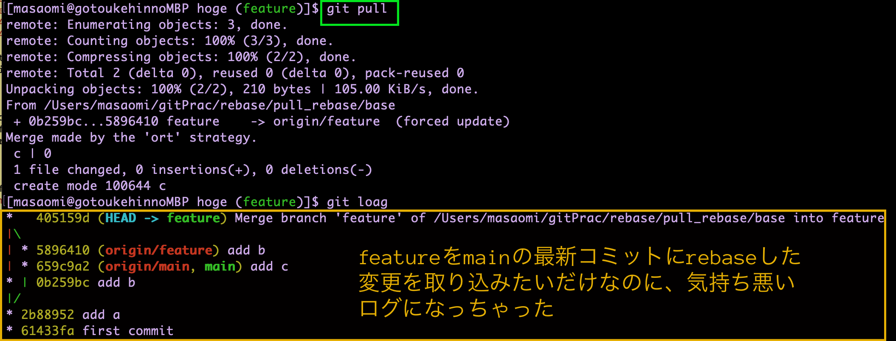

<br>

git reflogでマージ前まで戻る
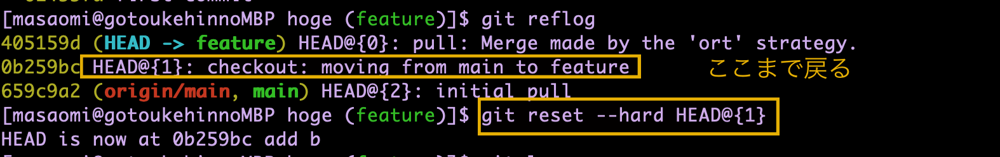

<br>

git logで履歴確認  
featureをorigin/featureにrebaseする
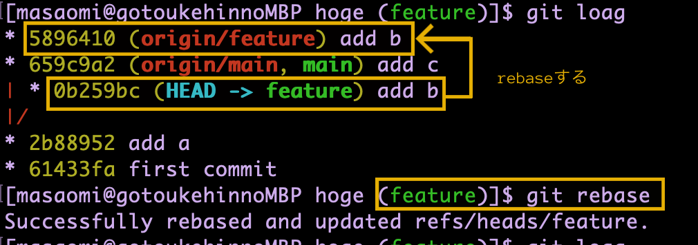

<br>

意図した結果になった
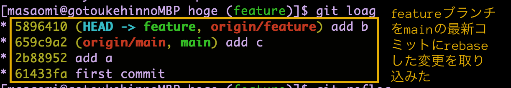

<br>

git reset で戻った後に git pull --rebaseでもうまくいった(こっちの方が簡単)
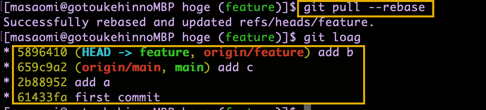
