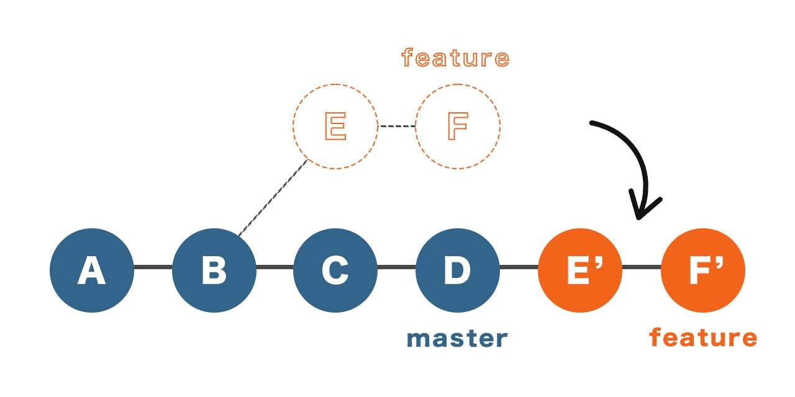
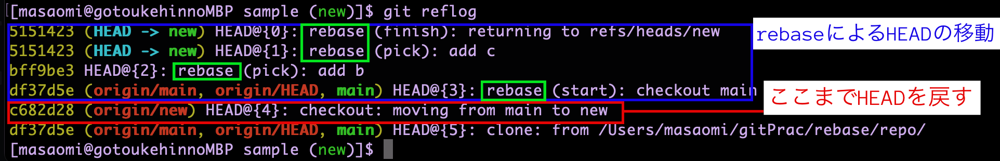
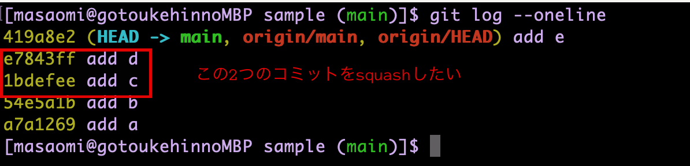
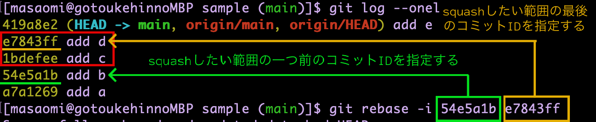
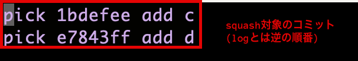
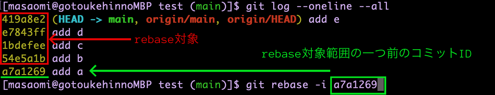
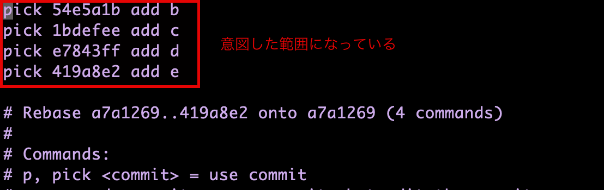
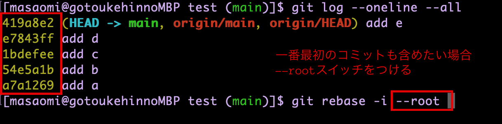
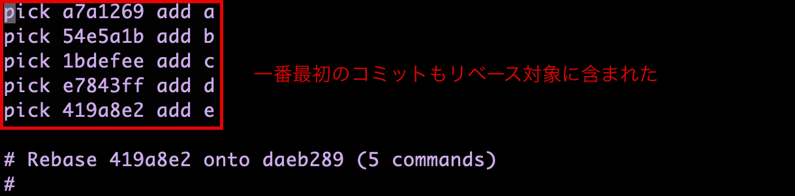

#目次

1. [rebaseとは](#sec1)
2. [rebaseの具体的なユースケース](#sec2)
3. [リベース対象のコミットを知る](#sec3)
4. [rebaseの使い方](#sec4)
5. [rebaseを取り消したい場合](#sec5)
6. [コミット履歴の整理(squash)](#sec6)
7. [コミット履歴の整理(squash) ver2](#sec7)
8. [一番最初のコミットもrebaseの対象に含める方法](#sec8)

---
<a id="sec1"></a>

### rebaseとは

- 指定したブランチの分岐点を変えるコマンド

<font color=red>リベースされたコミットはコミットIDが変わる</font>


[source: git rebaseの具体的なメリット](https://zenn.dev/tana0102/articles/475d8952933af6)

- ローカルのコミット履歴を合成して一つにする(squash)

*<font color=red>プッシュしたコミットをリベースしてはいけない -> コミットIDが変わるから</font>

---
<a id="sec2"></a>

### rebaseの具体的なユースケース

- featureブランチで作業指定していて、masterの新しい変更を取り込みたいとき  
    -> rebaseコマンドでfeatureブランチの分岐点を変更する

- リモートにプッシュする前に、ローカルのコミット履歴を綺麗にしてからプッシュしたい

---
<a id="sec3"></a>

### rebase前にリベースされるコミットを知る

ブランチAにあってブランチBにないコミットを表示する
```bash
git log <ブランチB>..<ブランチA>
```
*イメージとしては、ブランチAとブランチBの共通コミットからブランチAの最新コミットまでを表示する

*ブランチAをブランチBにリベースするとき、上記コマンドで表示されるコミットたちがリベースされるコミット

---
<a id="sec4"></a>

### rebaseする

2つの方法がある  
1. リベースしたいブランチにチェックアウトして分岐点を変更
2. リベースしたいブランチと分岐点を指定(どこのブランチにいても大丈夫)  
*方法2は指定順を間違えると大変なことになる

方法1
```bash
# リベースしたいブランチにチェックアウト
git checkout <リベースしたいブランチ>

git rebase <変更先分岐点>
```
*<font color=red>分岐点はコミットIDだったりブランチ名だったり</font>

方法2
```bash
git rebase <変更先分岐点> <リベースしたいブランチ>
```

---
<a id="sec5"></a>

### rebaseを取り消したい場合

まずはgit reflogでrebase前のHEADの履歴を調べる
```bash
git reflog
```



<br>
上記コマンドからHEAD@{4}にHEADを戻せばいいとわかる

```bash
git reset --hard HEAD@{4}
```
*--hardはステージングエリア&作業ディレクトリの両方がリセットされる

---
<a id="sec6"></a>

### コミット履歴の整理(squash)

- 現在のブランチの特定のコミット以降のを編集する  

<font color=red>コミットIDの指定が少し奇妙</font>  
->編集したいコミットの一つ前のコミットIDを指定する

例
squashしたいコミットを確認する


<br>

```bash
git rebase -i <squashしたい範囲の一つ前のコミットID> <squashしたい範囲の最後のコミットID>
```


<br>

rebaseの対象が正しく出ているか確認


---
<a id="sec7"></a>

### コミット履歴の整理(squash) ver2.

- もし、一つのコミットIDのみ指定すると、そのコミットの次のコミットから、現在のコミットまでが　squash対象になる

```bash
git rebase -i <対象範囲の一つ前のコミットID>
```



<br>



<br>

<font color=red>そしたら、一番最初のコミットはrebaseできない?</font>  
[->解決策](#sec8)

---
<a id="sec8"></a>

### 一番最初のコミットもrebaseの対象に含める方法

```bash
# 一番最初から一番最後のコミットまでrebaseする場合
git rebase -i --root
```



結果




```bash
# 一番最初から特定のコミットまでrebaseする場合
git rebase -i --root <対象範囲の最後のコミットID>
```