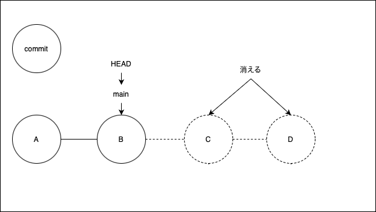

### git resetとは

- HEADを移動させる

- [ステージングされた変更の取り消し](./git_resetとgit_restore.md)

---

### HEADの状態を変更する

```bash
git reset <オプション> <移動先コミット>
```

例: 現在のHEADの状態を過去に戻したい(resetで)


<br>

Bのコミットまで、HEADを戻す  
*B以降のコミットは消えてしまう


- オプションの種類  

| オプション | 説明 |
| - | - |
| --soft | HEADだけを動かし、ステージングエリア&作業ディレクトリはそのまま |
| --mixed<br>または、指定なし(デフォルト) | HEADとステージングエリアを変更<br>作業ディレクトリはそのまま |
| --hard | HEAD、ステージングエリア、作業ディレクトリ全て変更 |

---

### 具体的な操作例

a b c dというファイルを作りコミットしてきた


<br>

しかし、c dはいらなかったので、コミットごと削除したい  
git reset <add b>のコミットで add b のコミットまで戻る

*<font color=red>git reset <コミットID>でもいい</font>  
上記の例だと git reset 2895638

---

### --soft/mixed/hardの違い

- --soft: HEADのみ変更し、ステージングエリア(インデックス)&作業ディレクトリは変更しない


<br>
"add b"のコミットまで--softで戻る


<br>

- --mixed(または指定なし): HEAD&ステージングエリアを変更し、作業ディレクトリは変更しない


<br>

"add b"のコミットまで--mixedで戻る


<br>

- --hard: HEAD&ステージングエリア&作業ディレクトリ全てを変更する


<br>

"add b"のコミットまで--hardで戻る


---

### 間違ってresetしてしまった

手順
1. git reflog でreset前の状態を探す
2. git reset --hard で上の状態に戻す

例


<br>

git reflog でreset前のHEADを探す


<br>

git reset --hard <reset前のHEAD>で戻る
