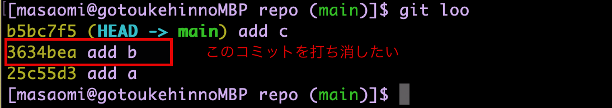
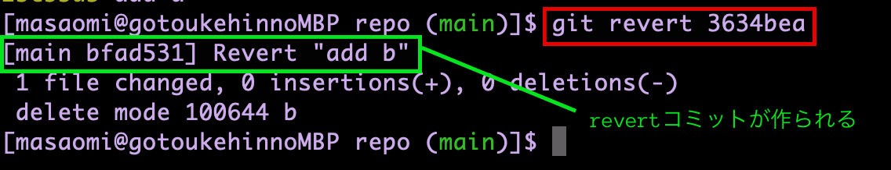
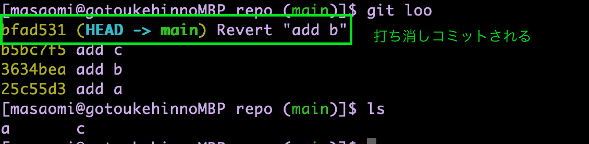

### revertとは

- 指定したコミットに対する打ち消しコミットを作成する

---

### revertする
```bash
git revert <打ち消したいコミットID>
```
*エディタが起動するので、コミットメッセージを編集してrevertコミットを作成

---

打ち消したいコミットを確認


<br>

git revertする


<br>

revertコミットが作成される


---

### 打ち消しとは?

- ファイルを作成したコミットを打ち消す -> そのファイルを削除するコミットが打ち消しコミット

- ファイルの行を削除したコミットを打ち消す -> その行を復元(追加)するコミットが打ち消しコミット

- ファイルの行を追加したコミットを打ち消す -> その行を削除するコミットが打ち消しコミット