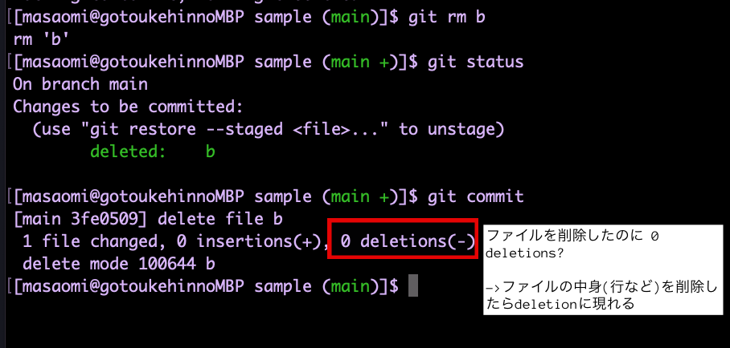

### リポジトリにコミットしたファイルを削除したい場合

1. git rm で対象ファイル削除
2. rm　で対象ファイル削除

<br>

- rmコマンドでファイルを削除した場合

    1. rmで対象ファイル削除
    2. git rm または add (対象ファイル) で削除したということをステージングエリアにあげる
    3. git commit で削除したということをコミットする


- git rm コマンドでファイルを削除した場合

    1. git rm (対象ファイル) で対象ファイルの削除&ステージングエリアに反映
    2. git commit で削除したということをコミットする

つまり、git rm コマンドを利用すると、削除したということ(情報)をステージングしなくても良くなる

---

### 利用例

事前準備
```bash
# いくつかファイルを作成して、コミットしておく
touch a b
git add .
git commit -m "first commit"
```

rmコマンドの例
```bash
# aファイルを削除
rm a

# aファイルを削除したということをステージングエリアにあげる
git add a
# もしくは　git rm a

# aファイルを削除したということをコミットする
git commit (a) -m "delete file a"
```

<br>

git rmコマンドの例
```bash
# bファイルを削除
git rm b

# すでにbファイルを削除したことはステージングされているので、コミット
git commit (b) -m "delete file b"
```

---

### ファイルを削除したのに0 deltetions?



上記のように、ファイル削除をコミットすると、コミット結果は 0 insertions, 0 deletions

deletionsやinsertionsはファイルの中身への変更を表す  
よって、ファイルの中身(行など)を削除すると、deletionsに現れる