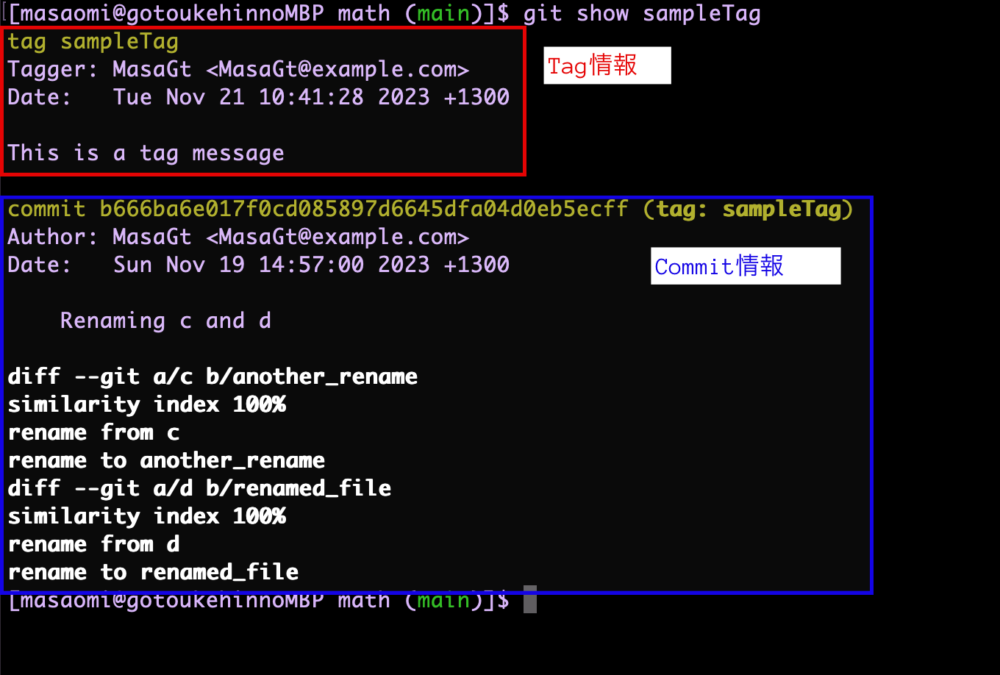
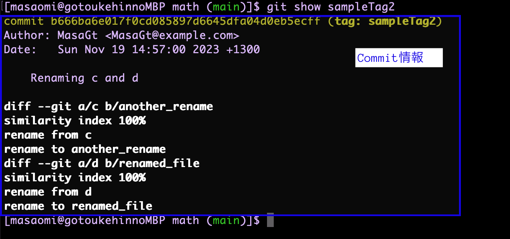

### コミットにタグをつける　

```bash
git tag <タグ名> (-m "msg")　<コミットID>
```

---

### タグの削除

```bash
git tag -d <タグ名>
```

---

### タグのリネーム

```bash
git tag <リネーム前のタグ名> (-m "msg") <リネーム後のタグ名>
```

*リネーム後は古いタグを下記コマンドで削除する必要がある
```bash
git tag -d <リネーム前のタグ名>
```

---

### タグのリストを表する

```bash
git tag
# もしくは
git tag -l (--list)
```

<br>

例
```bash
# tagの作成
git tag sampleTag b666ba6
git tag sampleTag2 d4e7241

# タグの一覧表示
git tag
# もしくは git tag -l か git tag --list
```

---

### タグをつけたコミットの情報を見る

```bash
git show <タグ名>
```

- tagにメッセージをつけた場合  
    tagの情報も表示される



<br>

- tagにメッセージをつけなかった場合
    コミットの情報のみ表示される


---

### オプション

- -m:　メッセージをつける

```bash
git tag <タグ名> -m "this is a tag" <コミットID>
```