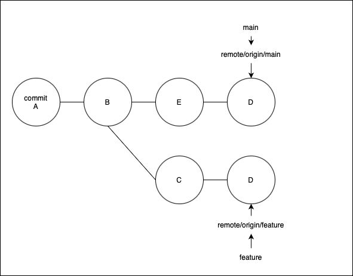
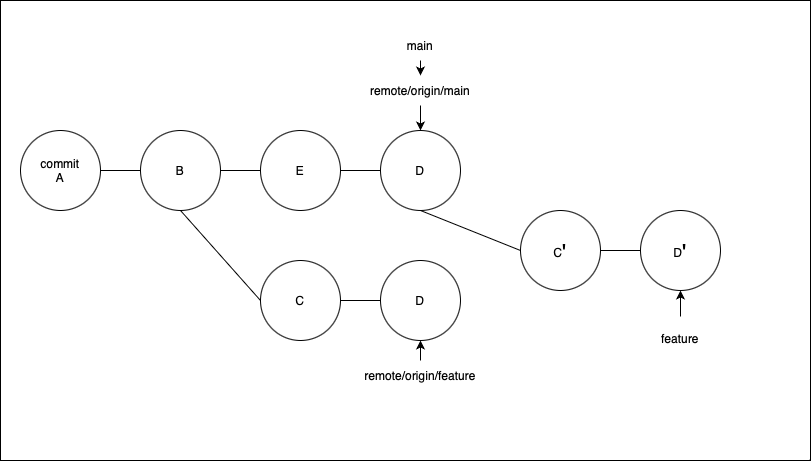
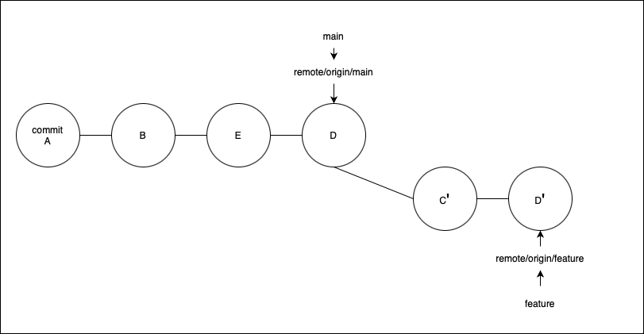

### rebaseとmergeの比較

mainからfeatureを切って開発中、他のブランチがmainに変更を反映した。feature側でmainの最新の変更を反映したい場合2つの方法がある。

1. rebaseでfeatureの分岐点をmainの最新コミットにする
2. mergeでmainの変更をfeatureに取り込む

---

### rebase

- メリット
    - コミット履歴が綺麗に保てる(マージコミットが発生しないから)

- デメリット
    - リモートにpushするときは-fで強制的にpushしなければならない
    - コミット履歴を改変するので、うまくやらないと他の人への影響が大きい
    - 分岐点を変えるので、いつ発生した開発/対応なのかわからなくなる

このようなリポジトリがあるとする

 

featureブランチをmainブランチの最新コミットにrebaseすると、featureのリモート追跡ブランチはそのまま残る

 

このままではpushしても失敗する  
-> featureブランチの親ブランチがremote/origin/featureと違うので、違うブランチだと認識される

 

解決するには git push -f で強制的にpushする

---

### rebaseされたブランチをpullする場合

- 何も考えずにpullすると、マージコミットが作られてしまう
[詳しくはここを参照](./git_pull.md#sec6)

---

### merge

- メリット
    - コミット履歴の改変をしないので、他の人に与える影響が少ない

- デメリット
    - mainから最新の変更をマージするたび、マージコミットが作成され、コミット履歴が汚く見える
