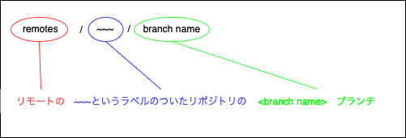
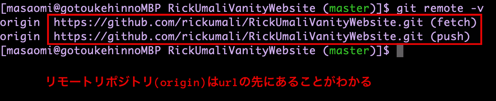
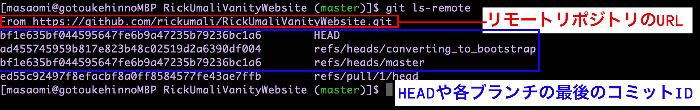
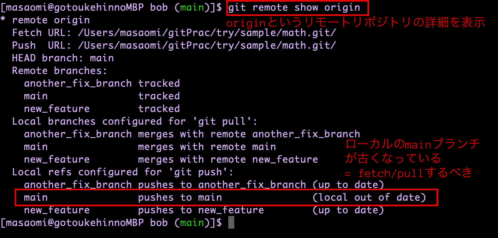

# 目次

1. [リモートブランチの読み方](#sec1)
2. [git remote](#sec2)
3. [リモートの追加](#sec3)
4. [リモートの削除](#sec4)
5. [リモートのurlの変更](#sec5)
6. [リモートのリネーム](#sec6)
7. [リモートリポジトリの状況確認](#sec7)

---
<a id="sec1"></a>

### remote/origin/ブランチ名の理解の仕方

- remote/origin/main の見方  
    -> originというremoteリポジトリのmainの追跡ブランチ


---
<a id="sec2"></a>

### リモートリポジトリの表示

リモートリポジトリ(ラベル)を表示
```bash
git remote
```

リモートリポジトリ(ラベル)とリモートリポジトリのpath/urlを表示
```bash
git remote -v
```


---
<a id="sec3"></a>

### <font color=red>リモートリポジトリを設定(追加)する</font>

```bash
git remote add <ラベル名> <source>
```

---
<a id="sec4"></a>

### リモートリポジトリの削除

```bash
git remote remove <ラベル名>
```

---
<a id="sec5"></a>

### リモートリポジトリのsourceを変更する

```bahs
git remote set-url <ラベル名> <新source>
```

---
<a id="sec6"></a>

### リモートリポジトリのラベル名の変更

```bash
git remote rename <リネーム前> <リネーム後>
```
*リモートリポジトリのラベル名はローカル側だけしか使われないので自由に変えることができる

---
<a id="sec7"></a>

### リモートリポジトリの最新状況を確認する　

1. git ls-remoteを利用する方法

```bash
git ls-remote (<リモートリポジトリのラベル名>)
```
*ラベル名を省略すると、デフォルトでoriginになるっぽい



2. git remote showを利用する方法

```bash
git remote show <リモートリポジトリのラベル名>
```



---
