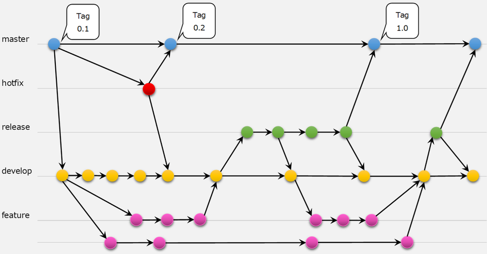

### git-flow

[source: 【Git】git-flowを知ろう！　利用時のルールについて](https://cloudsmith.co.jp/blog/efficient/2020/08/1534208.html)

 

- 主要ブランチ(永続ブランチ)

    - main: 製品コードがある。ここでは作業しない
    - develop: リリース前はこのブランチが最新バージョンとなる。リリース準備ができたらreleaseへマージする。ここでは作業しない

 

- 作業ブランチ
    
    - feature: 機能の開発用ブランチ。 
        - develop から切って、 develop にマージする。
        - 規模が大きくなる場合は、親featureから子featureブランチを切る。
        - 終了したらfeatureブランチを削除する。

    - release: リリース準備用ブランチ
        - リリース前の小さなバグの修正やメタデータ(バージョン番号)の更新作業をする。
        - developから切って、developとmainにマージする。
        - mainへのマージにはタグをつける。
        - 終了したらreleseブランチを削除する。

    - hotfix: 緊急のバグfixブランチ
        - 主にmainから切られ、developとmainにマージする。
        - mainへのマージにはタグをつける。
        - 終了したらhotfixブランチは削除する。

- 決まりごと
    - マージの際は --no-ff でマージコミットを作ること
    - feature, hotxfix, releaseブランチの名前は feature-\*, hotfix-\* release-\*  
    もしくは feature/\*, hotfix/\*, release/\*

---

### Git Hub Flow

- 主要ブランチ(永続ブランチ)

    - main: 製品コードがある。ここでは作業しない
    - feature: 機能の開発用ブランチ。 
        - mainから切られ、mainにマージする。
        - mainへマージ後も消さない
        - 説明的なブランチ名にする
    
- 決まりごと
    - マージする際は、プルリクエストを送る
    - こまめにコミットし、こまめにリモートにpush