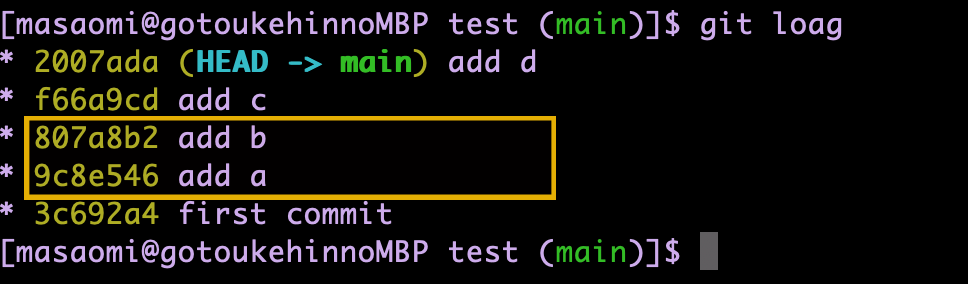
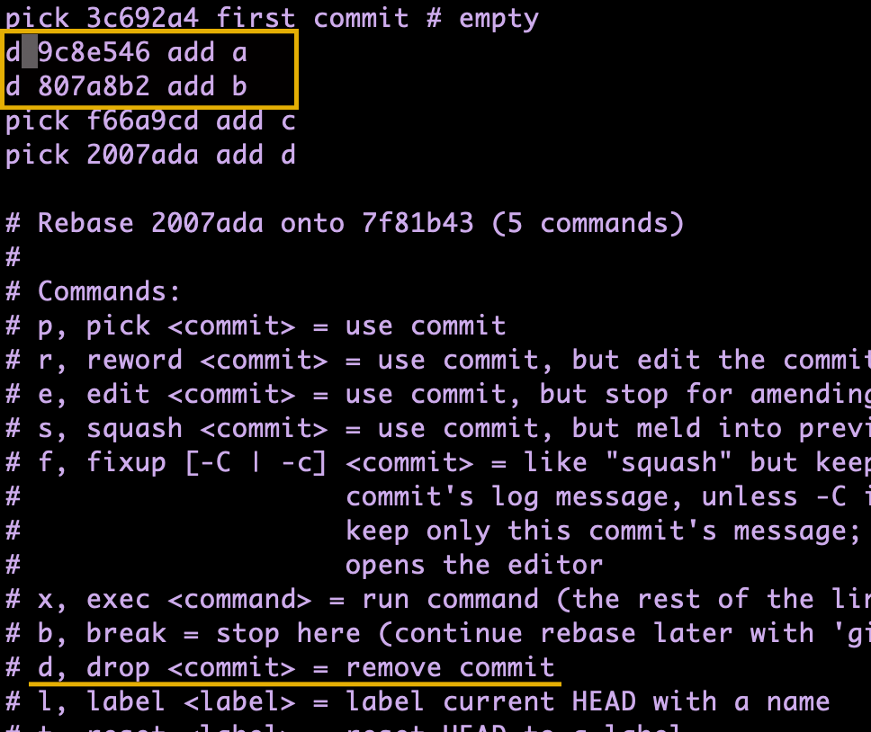
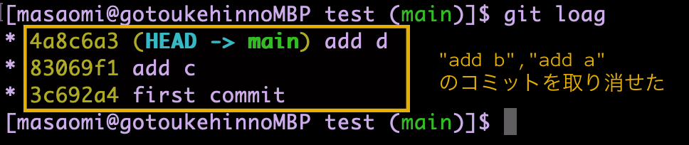

### 直前のコミットを取り消す

```bash
git reset --hard HEAD^
```

---

### 過去のコミットをいくつか指定して取り消したいとき

- git rebase -i


例
"add b", "add a"のコミットを取り消したいとする


<br>

git rebase -i でコミット履歴の編集  
取り消したいコミットの横にd(drop)と入力


<br>

log で確認

