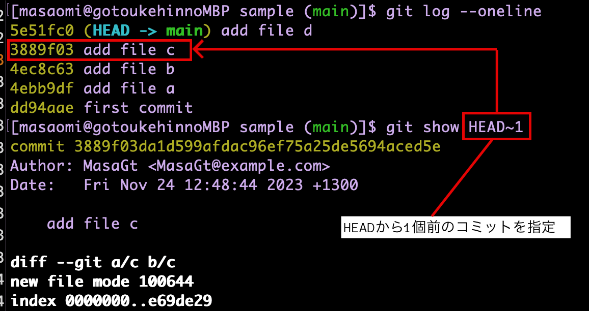
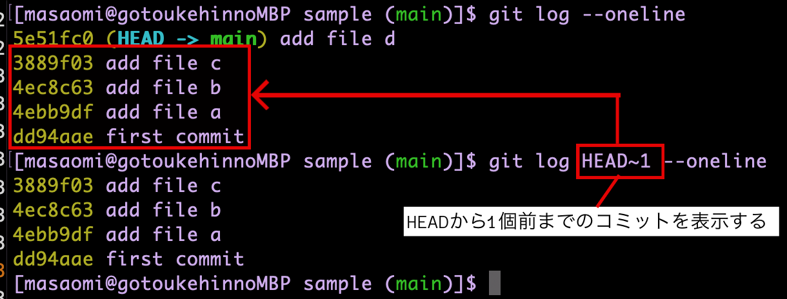

# 目次

1. [~でのコミットの指定](#sec1)

2. [^でのコミットの指定](#sec2)

3. [コミットのgrep方法](#sec3)

---
<a id="sec1"></a>

### ~でのコミット指定

HEADからn個前のコミット
```
HEAD~<n>
```

あるコミットからn個前のコミット
```
<コミットID>~<n>
```

例
```bash
# HEADから1個前のコミットを表示したい
git show HEAD~1
```



<br>

例
```bash
# HEADから1個前のコミットまでのコミットログを表示したい
git log HEAD~1 --oneline
```




---
<a id="sec2"></a>

### ^でのコミット指定

HEADから1個前のコミット
```
HEAD^
```

あるコミットから1個前のコミット
```
<コミットID>^
```

2個前、3個前のコミットの指定は
```
HEAD^^
HEAD^^^
```

例
```bash
# HEADから1個前のコミットを表示したい
git show HEAD^

# 結果はgit show HEAD~1と同じ
```

---
<a id="sec3"></a>

### コミットのgrep

