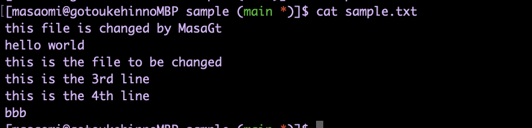
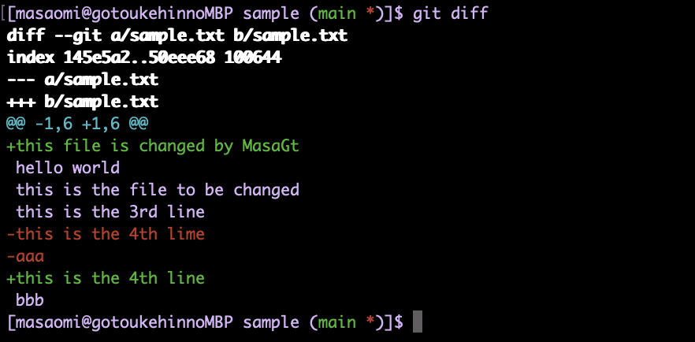
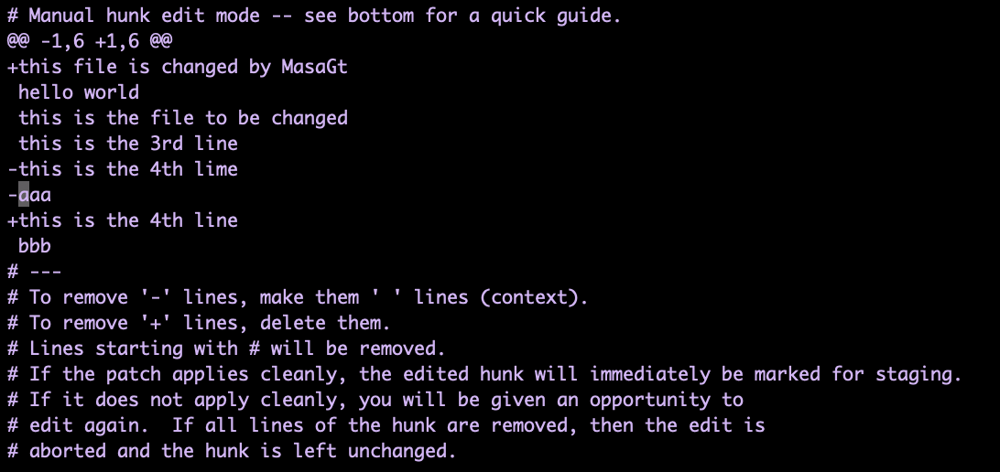
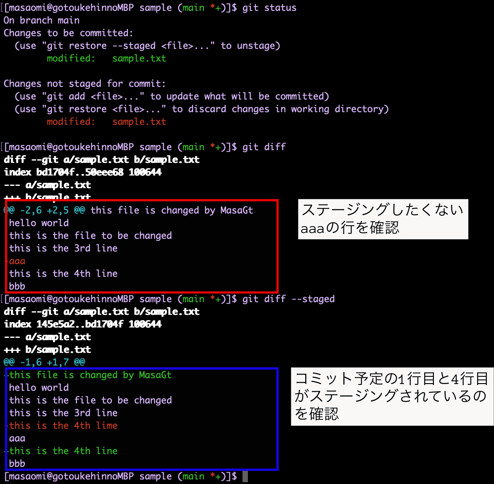

### ファイルの変更部を選択してコミットできる

- -p(--pacth)引数  

```bash
git add (対象) -p
```

<br>

---

利用例

変更前のファイルの中身


<br>

以下のように中身を編集  
(新規追加:1行目, 変更: 5行目, 削除:6行目)


```bash
# 変更部分を確認する
git diff sample.txt
```



<br>


```bash
git add -p sample.txt
#もしくは git add --patch sample.txt

# 操作は忘れがちなので、?を入力して、ガイドを出す
# (1/1) Stage this hunk [y,n,q,a,d,s,e,?]?

# 手作業でステージング部分を選択したいので、eを選択
# (1/1) Stage this hunk [y,n,q,a,d,s,e,?]e
```

<br>

今回は、1行目のthis file changed ~~　とtypoの4th lineだけを反映させたい



<br>

変更をステージングしたくない行は、行頭の+や-を消す  
したがって、-aaaの-を消し<font color=red>スーペースを一つ入れる</font>


<br>

編集を完了し、ステージングされた部分を確認
```bash
git status
git diff
git diff --staged
```



<br>

変更部分をコミット

```bash
git commt (sample.txt -m "add who fixed the file and fix a typo")
```

---

### マニュアルでのステージング部分の反映方法

- -で始まる行
    - -を削除して1スペース挿入すると、その変更行は反映されない

- +で始まる行
    - +で始まる行を全て削除するとその変更行は反映されない
    - ↑の方法でうまくいかない場合、 +だけを削除するとその変更行は反映されない


